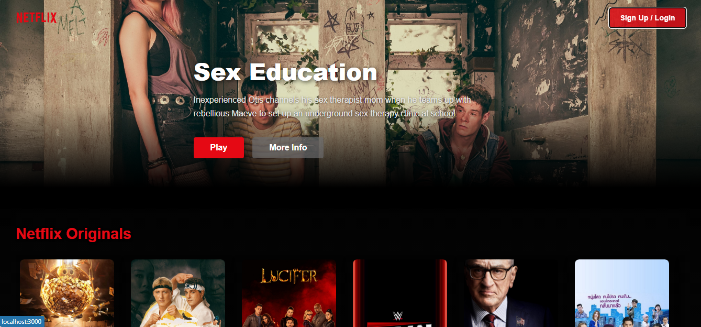

# Netflix Clone

## Overview
Welcome to the Netflix Clone, a modern, responsive web application built with React that replicates the core functionality and design of Netflix. This project allows users to browse trending movies, Netflix Originals, and various genres (Action, Comedy, Horror, Romance, Documentaries, and Top Rated), view movie details, and watch trailers in a sleek, interactive modal popup. The design is inspired by Netflix's premium, cinematic style, featuring smooth animations, dark-themed gradients, and a responsive layout for desktops, tablets, and mobile devices.



This application uses the TMDB (The Movie Database) API to fetch movie data and integrates YouTube trailers via the `movie-trailer` package. It’s built with modern React practices, including hooks, lazy loading, and animations powered by Framer Motion.

## Features
- **Dynamic Movie Listings**: Display categories like Netflix Originals, Trending, Top Rated, and genre-specific movies.
- **Interactive Banner**: A featured movie banner with play and info buttons, showcasing a random Netflix Original.
- **Trailer Popups**: Click movie posters to view trailers in a modern modal popup.
- **Hover Effects**: Eye-catching hover effects on movie posters with "View Trailer" text.
- **Responsive Design**: Fully responsive layout that works on screens from 320px to 1368px and beyond.
- **Smooth Animations**: Subtle animations for transitions, hovers, and modal interactions using Framer Motion.
- **Lazy Loading**: Efficient image loading using `react-intersection-observer` for performance optimization.

## Prerequisites
Before you begin, ensure you have the following installed:
- **Node.js**: Version 14 or higher (recommended: LTS version).
- **npm**: Version 6 or higher (comes with Node.js).
- **Git**: For cloning the repository (optional if downloading).

## Installation

### 1. Clone the Repository
Clone this repository to your local machine using:
```bash
git clone https://github.com/KiaBoluki/netflix-clone.git
cd netflix-clone
```

### 2. Install Dependencies
Install the required dependencies using npm:
```bash
npm install
```

### 3. Configure TMDB API Key
This application uses the TMDB API to fetch movie data. You need to obtain an API key from [TMDB](https://www.themoviedb.org/documentation/api) and update the `requests.js` file:

1. Sign up or log in to TMDB.
2. Create an API key (v3 auth).
3. Replace the `API_KEY` constant in `src/requests.js` with your TMDB API key:
   ```javascript
   const API_KEY = "your-tmdb-api-key-here";
   ```

### 4. Run the Application
Start the development server:
```bash
npm start
```
This will launch the app in your default browser at `http://localhost:3000`. The app will automatically reload if you make changes to the code.

### 5. Build for Production
To create a production build, run:
```bash
npm run build
```
This generates an optimized build in the `build` folder, ready for deployment.

## Usage
- Navigate through the homepage to explore different movie categories.
- Hover over movie posters to see "View Trailer" and click to open a modal with the trailer.
- Use the banner to view featured Netflix Originals and interact with Play/More Info buttons (currently dummy buttons—extend functionality as needed).
- The design is fully responsive, so try resizing your browser or testing on mobile devices.

## Project Structure
```
netflix-clone/
├── src/
│   ├── App.jsx              # Main app component
│   ├── index.jsx            # Entry point
│   ├── requests.js          # API endpoints configuration
│   ├── components/          # React components
│   │   ├── Banner.jsx       # Banner component
│   │   ├── Navbar.jsx       # Navigation bar
│   │   ├── Poster.jsx       # Movie poster component
│   │   ├── Row.jsx          # Movie rows component
│   │   ├── Modal.jsx        # Trailer modal component
│   ├── assets/              # Static assets and styles
│   │   ├── style/           # CSS files for styling
│   │   └── img/             # Images (e.g., Netflix logo)
├── package.json             # Project metadata and dependencies
├── README.md                # This file
└── .gitignore               # Files to ignore in Git
```

## Dependencies
See `package.json` for the full list of dependencies. Key dependencies include:
- `react`, `react-dom`: Core React libraries.
- `framer-motion`: For animations.
- `react-intersection-observer`: For lazy loading images.
- `react-youtube`: For embedding YouTube videos.
- `movie-trailer`: For fetching trailer URLs.
- `axios`: For HTTP requests to TMDB.

## Contributing
We welcome contributions to improve this project! Here’s how you can contribute:

1. **Fork the Repository**: Create your own fork of this repository.
2. **Create a Branch**: Use a descriptive branch name (e.g., `feature/new-component`).
3. **Make Changes**: Implement your changes or fixes.
4. **Test Thoroughly**: Ensure your changes don’t break existing functionality and pass any tests.
5. **Submit a Pull Request**: Open a PR with a clear description of your changes.

### Code Style
- Follow the existing code formatting (ESLint and Prettier are recommended, as configured by Create React App).
- Use meaningful variable and function names.
- Add comments for complex logic.

### Issues
Report bugs or suggest features by opening an issue on GitHub. Please include:
- A clear description of the problem or feature.
- Steps to reproduce (if applicable).
- Expected vs. actual behavior.

## License
This project is licensed under the MIT License. See the `LICENSE` file for details (if not present, create one with the following content):

```
MIT License

Copyright (c) [2025] Kia Boluki

Permission is hereby granted, free of charge, to any person obtaining a copy
of this software and associated documentation files (the "Software"), to deal
in the Software without restriction, including without limitation the rights
to use, copy, modify, merge, publish, distribute, sublicense, and/or sell
copies of the Software, and to permit persons to whom the Software is
furnished to do so, subject to the following conditions:

The above copyright notice and this permission notice shall be included in all
copies or substantial portions of the Software.

THE SOFTWARE IS PROVIDED "AS IS", WITHOUT WARRANTY OF ANY KIND, EXPRESS OR
IMPLIED, INCLUDING BUT NOT LIMITED TO THE WARRANTIES OF MERCHANTABILITY,
FITNESS FOR A PARTICULAR PURPOSE AND NONINFRINGEMENT. IN NO EVENT SHALL THE
AUTHORS OR COPYRIGHT HOLDERS BE LIABLE FOR ANY CLAIM, DAMAGES OR OTHER
LIABILITY, WHETHER IN AN ACTION OF CONTRACT, TORT OR OTHERWISE, ARISING FROM,
OUT OF OR IN CONNECTION WITH THE SOFTWARE OR THE USE OR OTHER DEALINGS IN THE
SOFTWARE.
```

## Acknowledgments
- Inspired by Netflix’s design and functionality.
- Utilizes the TMDB API for movie data.
- Thanks to the open-source community for libraries like React, Framer Motion, and more.

## Contact
For questions or feedback, contact kia.boluki@gmail.com or open an issue on this repository.

